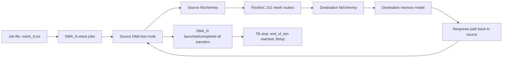

# FlooNoC-HAMSA Integration Status

## Current status

This document summarizes what has already been achieved in the FlooNoC environment and what remains before replacing the HAMSA interconnect with FlooNoC.

### Completed work

- Reviewed repository structure, testbenches, generator configs, and build flow.
- Added HAMSA-oriented config artifacts:
  - `hw/test/floo_hamsa_params_pkg.sv`
  - `floogen/examples/hamsa_axi_mesh_2x2.yml`
- Rebuilt the active `axi_mesh` demo profile as a 2x2 HAMSA-like configuration:
  - `floogen/examples/axi_mesh_xy.yml`
  - `hw/test/floo_test_pkg.sv`
  - `hw/tb/tb_floo_axi_mesh.sv`
  - `util/gen_jobs.py`
- Fixed FlooGen/SystemVerilog generation compatibility for current Questa Starter parser:
  - `floogen/templates/floo_axi_router.sv.mako`
  - `floogen/templates/floo_nw_router.sv.mako`
  - `hw/floo_axi_router.sv`
  - `hw/floo_nw_router.sv`
- Replaced randomize-dependent test memory backends (for Starter license compatibility):
  - `hw/test/floo_axi_rand_slave.sv` now uses deterministic `axi_sim_mem`
  - `hw/test/floo_hbm_model.sv` now uses deterministic `axi_sim_mem`
- Achieved successful mesh simulation runs with:
  - no compile errors
  - no runtime fatal errors (after deterministic model change)
  - valid read-only and write-only traffic runs
  - per-DMA monitor statistics printed and simulation ending at TB `$stop`.

### What this proves

- End-to-end path in test environment works:
  - DMA source -> NI/chimney -> mesh routers -> memory-side NI/model -> response back.
- Toolchain can run this flow in your current Questa Starter setup using deterministic models.

## Active HAMSA-like demo profile

| Factor | Active FlooNoC Demo Value | HAMSA Table Target | Status |
|---|---:|---:|---|
| Mesh topology | 2x2 | small/easy demo, future 4x4 optional | Match for bring-up |
| AXI data width | 32 bit | 32 bit | Match |
| AXI address width | 32 bit | 32 bit | Match |
| AXI ID width | 10 bit | up to 10 bit | Match |
| AXI user width | 1 bit | confirm from HAMSA RTL | Assumption |
| Ordering profile | `NoRoB`, `MaxUniqueIds=1` | in-order/simple | Match for first bring-up |
| Memory target | deterministic `axi_sim_mem` test target | HAMSA local memory/TCM later | Test substitute |
| Clock/reset | one clock, active-low `rst_ni`/`rst_n` | confirm from HAMSA top | Likely adaptable |

The active generated module name remains `floo_axi_mesh_noc` so the existing Bender target and `tb_floo_axi_mesh` flow still work. In this demo, any `hbm` naming should be read as a test memory target, not real HAMSA HBM.

## Remaining work for real HAMSA replacement

### Must-match interface contract

- Freeze exact HAMSA AXI port contracts:
  - `AddrWidth`, `DataWidth`, `ID`, `User`, `strb`, burst support.
- Verify ordering model:
  - in-order assumptions vs multi-ID outstanding behavior.
- Confirm required/no-required AXI features:
  - ATOP/exclusive/cache/prot/qos handling.

### Address and endpoint mapping

- Map HAMSA masters/slaves to NoC endpoints.
- Encode HAMSA memory map ranges into NoC routing/address rules.
- Validate no holes/overlaps in address regions.

### Integration wrappers and clocks/resets

- Finalize bridge/wrapper between HAMSA-side signals and NoC AXI NI.
- Verify reset polarity/sequencing and clock-domain assumptions.

### Functional closure tests

- Directed tests:
  - read-only, write-only, mixed read/write.
- Data integrity:
  - write then readback must match.
- Basic backpressure and response propagation checks.

## Dataflow and simulation lifecycle



### Example runtime markers

- Job start marker:
  - `[DMA1] Reading from hw/test/jobs/mesh_0.txt`
- Transfer launch marker:
  - `[DMA1] Launching 100 jobs copying ...`
- Completion marker:
  - `[DMA1] Launched all Transfers.`
- End-of-simulation marker:
  - `Break at ... tb_floo_axi_mesh.sv line 180`

## Regenerate and compile active 2x2 demo

```bash
cd /mnt/c/Users/eyals/FlooNoC
rm -f generated/floo_axi_mesh_noc.sv generated/floo_axi_mesh_noc_pkg.sv
PYTHONPATH=. python3 -m floogen.cli rtl -c floogen/examples/axi_mesh_xy.yml -o generated --no-format
make clean-vsim
make compile-vsim TB_DUT=tb_floo_axi_mesh EXTRA_BENDER_FLAGS="-t axi_mesh"
```

## Mixed read/write job example

This creates four DMA job files for the 2x2 mesh:

- `mesh_0.txt`, `mesh_1.txt`: read traffic
- `mesh_2.txt`, `mesh_3.txt`: write traffic

```bash
rm -rf hw/test/jobs_read hw/test/jobs_write hw/test/jobs_mix
util/gen_jobs.py --out_dir hw/test/jobs_read  --tb dma_mesh --traffic_type uniform --rw read  --num_wide_bursts 1 --num_narrow_bursts 0
util/gen_jobs.py --out_dir hw/test/jobs_write --tb dma_mesh --traffic_type uniform --rw write --num_wide_bursts 1 --num_narrow_bursts 0
mkdir -p hw/test/jobs_mix
cp hw/test/jobs_read/mesh_0.txt  hw/test/jobs_mix/mesh_0.txt
cp hw/test/jobs_read/mesh_1.txt  hw/test/jobs_mix/mesh_1.txt
cp hw/test/jobs_write/mesh_2.txt hw/test/jobs_mix/mesh_2.txt
cp hw/test/jobs_write/mesh_3.txt hw/test/jobs_mix/mesh_3.txt
```

## GUI run command

```bash
make run-vsim \
  TB_DUT=tb_floo_axi_mesh \
  EXTRA_BENDER_FLAGS="-t axi_mesh" \
  JOB_NAME=mesh \
  JOB_DIR=hw/test/jobs_mix \
  TRAFFIC_INJ_RATIO=1.0 \
  VSIM_FLAGS="-64 -t 1ps -sv_seed 0 -work work -suppress 14408 -suppress 16154 +JOB_NAME=mesh +JOB_DIR=hw/test/jobs_mix +TRAFFIC_INJ_RATIO=1.0"
```

## Minimal wave commands

Paste these in the Questa Transcript after loading the GUI. In the mixed job recipe, `mesh_0` is DMA `(0,0)` read traffic and `mesh_2` is DMA `(1,0)` write traffic.

```tcl
view wave
delete wave *
add wave sim:/tb_floo_axi_mesh/clk
add wave sim:/tb_floo_axi_mesh/rst_n
add wave sim:/tb_floo_axi_mesh/end_of_sim[0][0]
add wave sim:/tb_floo_axi_mesh/cluster_in_req[0][0].ar_valid
add wave sim:/tb_floo_axi_mesh/cluster_in_req[0][0].ar.addr
add wave sim:/tb_floo_axi_mesh/cluster_in_rsp[0][0].r_valid
add wave sim:/tb_floo_axi_mesh/cluster_in_rsp[0][0].r.data
add wave sim:/tb_floo_axi_mesh/cluster_in_rsp[0][0].r.last
add wave sim:/tb_floo_axi_mesh/cluster_in_rsp[0][0].r.resp
add wave sim:/tb_floo_axi_mesh/cluster_in_req[1][0].aw_valid
add wave sim:/tb_floo_axi_mesh/cluster_in_req[1][0].aw.addr
add wave sim:/tb_floo_axi_mesh/cluster_in_req[1][0].w_valid
add wave sim:/tb_floo_axi_mesh/cluster_in_req[1][0].w.data
add wave sim:/tb_floo_axi_mesh/cluster_in_rsp[1][0].b_valid
add wave sim:/tb_floo_axi_mesh/cluster_in_rsp[1][0].b.resp
run -all
```

### Pass criteria

- Write job:
  - `aw_valid` appears with the expected address.
  - `w_valid` sends data.
  - `b_valid` returns.
  - `b.resp == 2'b00`.
- Read job:
  - `ar_valid` appears with the expected address.
  - `r_valid` returns.
  - final beat has `r.last == 1`.
  - `r.resp == 2'b00`.
- Full run:
  - all active DMAs complete.
  - `end_of_sim` rises.
  - transcript ends with `Errors: 0`.

